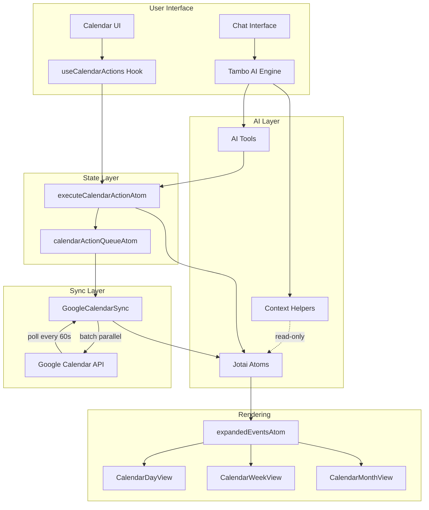

# Architecture

## Overview

Brilliant is an AI-powered calendar that lets users manage events through both a visual calendar interface and natural language chat. Events flow through a centralized Jotai state layer, with two-way Google Calendar synchronization.



## Directory Structure

```
src/
├── App.tsx                     # Root provider setup (Tambo, Google Auth, context helpers)
├── main.tsx                    # Entry point
├── components/
│   ├── auth/                   # Google login, session expired dialog
│   ├── calendar/               # Calendar views + sync
│   │   ├── CalendarRoot.tsx        # View switching (day/week/month)
│   │   ├── CalendarDayView.tsx     # Single-day time grid
│   │   ├── CalendarWeekView.tsx    # 7-day time grid
│   │   ├── CalendarMonthView.tsx   # Month grid
│   │   ├── CalendarShell.tsx       # Toolbar, navigation, wraps views
│   │   ├── GoogleCalendarSync.tsx  # Headless sync component (queue processor)
│   │   ├── EventCard.tsx           # Individual event rendering
│   │   ├── EventDetailsDialog.tsx  # Event detail/edit modal
│   │   └── NewEventDialog.tsx      # New event creation modal
│   ├── chat/                   # Chat panel, message bubbles
│   ├── generative/             # Tambo generative components (GenerativeForm)
│   ├── tambo/                  # Tambo message renderers, thread sidebar
│   └── ui/                     # Shared UI primitives (buttons, dialogs, etc.)
├── contexts/
│   └── GoogleAuthContext.tsx    # Google OAuth implicit flow
├── hooks/
│   └── useCalendarActions.ts   # Hook for add/update/delete/move/undo/redo
├── lib/
│   ├── tambo/
│   │   ├── index.tsx              # Tambo component registration
│   │   ├── schemas.ts             # Zod schemas for tool I/O
│   │   ├── tools.ts               # AI tool definitions (5 tools)
│   │   └── components.tsx         # Generative component exports
│   ├── calendarUtils.ts        # Event construction helpers
│   ├── dateUtils.ts            # Recurring event expansion, date math
│   └── eventLayoutUtils.ts    # Overlap detection, column assignment
├── state/
│   ├── calendarAtoms.ts        # Core Jotai atoms (events, view, selected date, history)
│   └── calendarEffects.ts      # Action queue, effect atoms, Google event ID propagation
├── types/
│   └── calendar.ts             # TypeScript types (CalendarEvent, CalendarAction, etc.)
└── pages/
    └── Home.tsx                # Main layout (sidebar + calendar)
```

## Key Data Flow

### 1. Event Mutation Pipeline

Both the UI and AI share the same mutation path:

```
User clicks / AI tool call
        │
        ▼
  Create CalendarAction
  (type, payload, source: "user" | "ai")
        │
        ▼
  Update eventsAtom (optimistic)
        │
        ▼
  executeCalendarActionAtom
  ├── Append to actionHistoryAtom (undo/redo)
  └── Push to calendarActionQueueAtom (sync)
        │
        ▼
  GoogleCalendarSync drains queue
  (5 concurrent, Promise.allSettled)
```

### 2. State Atoms

| Atom                      | Type                         | Purpose                                             |
| ------------------------- | ---------------------------- | --------------------------------------------------- |
| `eventsAtom`              | `CalendarEvent[]`            | Master event list (source of truth)                 |
| `expandedEventsAtom`      | Derived                      | Expands recurring events for the visible date range |
| `selectedDateAtom`        | `Date`                       | Currently focused date                              |
| `viewAtom`                | `"day" \| "week" \| "month"` | Active calendar view                                |
| `actionHistoryAtom`       | `CalendarAction[]`           | Full mutation history (undo)                        |
| `redoStackAtom`           | `CalendarAction[]`           | Undone actions (redo)                               |
| `calendarActionQueueAtom` | `CalendarAction[]`           | Pending Google sync queue                           |
| `pendingDeletesAtom`      | `string[]`                   | Google event IDs awaiting deletion                  |

### 3. AI Integration (Tambo)

**Tools** — the AI calls these to mutate calendar state:

| Tool                  | Purpose                                          | When to use                |
| --------------------- | ------------------------------------------------ | -------------------------- |
| `createCalendarEvent` | Create a single event                            | One new event              |
| `getCalendarEvents`   | Query events by date range                       | "What's on my calendar?"   |
| `updateCalendarEvent` | Modify one event                                 | Single change              |
| `deleteCalendarEvent` | Remove one event                                 | Remove one event           |
| `batchCalendarUpdate` | Create/update/delete multiple events in one call | **2+ changes** (preferred) |

The `batchCalendarUpdate` tool uses a **JSON string** for its `operations` field to avoid Tambo's streaming object decomposition. The AI outputs a JSON array as a string, and the handler `JSON.parse()`s it.

**Context Helpers** — provide read-only awareness to the AI (no auto-registered tools):

| Helper                  | Data provided                                                         |
| ----------------------- | --------------------------------------------------------------------- |
| `userTimeContext`       | Current time, timezone                                                |
| `calendarViewContext`   | Selected date, active view, contextual range description              |
| `upcomingEventsContext` | Visible events with IDs, titles, times (filtered to exact view range) |

### 4. Google Calendar Sync

`GoogleCalendarSync.tsx` is a headless component that:

1. **On mount**: Fetches all events from Google Calendar, merges into `eventsAtom`
2. **On queue change**: Batch-drains `calendarActionQueueAtom`:
   - Takes all queued actions at once, clears the queue
   - Processes in chunks of 5 concurrent API calls (`Promise.allSettled`)
   - Re-queues failures with a 2-second backoff
3. **Polling**: Fetches external changes every 60 seconds
4. **ID propagation**: When a local event gets a Google event ID, propagates it to pending queue actions

## Design Decisions

### Why JSON String for Batch Tool?

Tambo streams tool inputs — arrays of objects arrive as `[{}, {}]` (empty shells) before their fields fill in. Using a `z.string()` field containing JSON avoids this: strings stream atomically and are never decomposed into empty objects.

### Why Context Helpers Instead of Interactable Components?

`withTamboInteractable` auto-registers an `update_component_props` tool that the AI calls unnecessarily. Context helpers provide the same event awareness without registering any tools.

### Why Jotai for State?

- Atomic updates — fine-grained subscriptions, no unnecessary re-renders
- Derived atoms — `expandedEventsAtom` auto-recomputes when events/view change
- Works well with Tambo tools — `getDefaultStore()` allows direct atom reads/writes from tool handlers (outside React tree)

### Why Queue-Based Sync?

Decouples UI responsiveness from network latency. Events update locally (optimistic), then sync to Google asynchronously. The queue handles retries, ordering, and Google event ID propagation.
