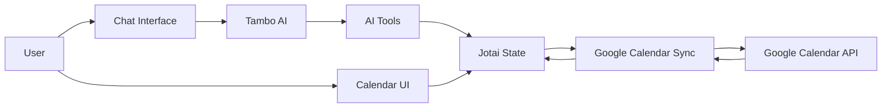

# Brilliant - AI-Powered Calendar

An intelligent calendar application with conversational AI capabilities, built with React and integrated with Google Calendar. Schedule, manage, and reorganize your events naturally through chat.

> **Thanks to**: [big-calendar.vercel.app](https://big-calendar.vercel.app/) - A fantastic open-source calendar project that influenced the visual design and user experience patterns.

## ✨ Features

### Calendar Views
- **Day View**: Focus on a single day with time-based event layout
- **Week View**: See your entire week at a glance with multi-day event support
- **Month View**: Monthly overview with event indicators
- Drag-and-drop event creation
- Current time indicator with auto-scroll

### AI-Powered Scheduling (via Tambo)
Chat naturally to manage your calendar:
- *"Schedule a team meeting tomorrow at 2pm for 1 hour"*
- *"Block out focus time every weekday morning"*
- *"Move my dentist appointment to next Thursday"*
- *"What do I have scheduled this week?"*

### Google Calendar Sync
- Two-way synchronization with Google Calendar
- Recurring event support (daily, weekly, monthly, yearly)
- Color mapping from Google Calendar
- Automatic sync every 60 seconds

## 🛠 Tambo Features Used

This project demonstrates several [Tambo](https://tambo.co) capabilities:

### AI Tools (Function Calling)
| Tool | Description |
|------|-------------|
| `createCalendarEvent` | Create events with optional recurrence |
| `getCalendarEvents` | Query events within a date range |
| `updateCalendarEvent` | Modify existing events |
| `deleteCalendarEvent` | Remove events |
| `reorganizeEvents` | Batch operations for schedule optimization |
| `createRecurringEvent` | Create events with complex recurrence patterns |

### Generative Components
- **GenerativeForm**: Dynamic, schema-driven forms for structured data collection

### Context Helpers
```typescript
contextHelpers: {
  userTimeContext: () => ({
    nowIso: new Date().toISOString(),
    nowLocal: new Date().toLocaleString(),
    timeZone: Intl.DateTimeFormat().resolvedOptions().timeZone,
  }),
}
```

### Thread Management
- Auto-generated thread names
- Thread history with conversation switching
- Checkpoint-based undo/revert system

## 🏗 Architecture

### How It Works



**1. User Interaction**
- Users can interact via the **Chat Interface** (natural language) or directly through the **Calendar UI** (drag-drop, click)
- Both paths update the same centralized state

**2. AI Processing (Tambo)**
- Natural language requests are processed by Tambo's LLM
- The AI calls registered tools (`createCalendarEvent`, `updateCalendarEvent`, etc.)
- Tools directly update Jotai atoms and emit calendar actions

**3. State Management (Jotai)**
- `eventsAtom`: Stores all calendar events (single source of truth)
- `expandedEventsAtom`: Derived atom that expands recurring events for display
- `actionHistoryAtom`: Tracks all changes for undo/redo support
- Events are tagged with their source: `user`, `ai`, or `google`

**4. Google Calendar Sync**
- `GoogleCalendarSync` is a headless component that runs in the background
- On mount: Fetches events from Google Calendar and merges with local state
- On change: Pushes local modifications to Google Calendar
- Polls every 60 seconds for external changes

**5. Rendering**
- Calendar views consume `expandedEventsAtom` for display
- Recurring events are expanded client-side within the visible date range
- Multi-day events are positioned using layout utilities

## ⚠️ Known Limitations

### Token Refresh (No Backend)
This app uses Google's **OAuth2 Implicit Grant Flow**, which only provides short-lived access tokens (~1 hour). There are no refresh tokens without a backend server implementing the Authorization Code flow.

**Current behavior**: When the token expires, users see a re-authentication dialog.

### Recurrence Support
The following recurrence features are supported:
- ✅ Daily, Weekly, Monthly, Yearly frequency
- ✅ Interval (every N days/weeks/etc.)
- ✅ Count-based limits
- ✅ End date limits
- ✅ BYDAY for weekly recurrence

Not yet supported:
- ❌ BYSETPOS, BYMONTHDAY complex rules
- ❌ Exception dates (EXDATE)

### Performance
For users with very large event counts (1000+), the client-side recurring event expansion may impact performance.

## 🚀 Getting Started

### Prerequisites
- Node.js 18+
- pnpm
- Google Cloud Console project with Calendar API enabled

### Environment Variables
```bash
VITE_TAMBO_API_KEY=your_tambo_api_key
VITE_GOOGLE_CLIENT_ID=your_google_client_id
```

### Installation
```bash
pnpm install
pnpm dev
```

## 📝 License

MIT
