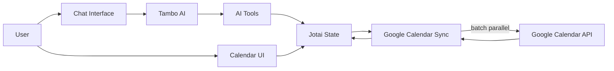

# Brilliant - AI-Powered Calendar

An intelligent calendar application with conversational AI capabilities, built with React and integrated with Google Calendar. Schedule, manage, and reorganize your events naturally through chat.

> **Thanks to**: [big-calendar.vercel.app](https://big-calendar.vercel.app/) - A fantastic open-source calendar project that influenced the visual design and user experience patterns.

## ✨ Features

### Calendar Views

- **Day View**: Focus on a single day with time-based event layout
- **Week View**: See your entire week at a glance with multi-day event support
- **Month View**: Monthly overview with event indicators
- Drag-and-drop event creation
- Current time indicator with auto-scroll

### AI-Powered Scheduling (via Tambo)

Chat naturally to manage your calendar:

- _"Schedule a team meeting tomorrow at 2pm for 1 hour"_
- _"Block out focus time every weekday morning"_
- _"Move my dentist appointment to next Thursday and add a gym session on Monday"_
- _"What do I have scheduled this week?"_

### Google Calendar Sync

- Two-way synchronization with Google Calendar
- Recurring event support (daily, weekly, monthly, yearly)
- Color mapping from Google Calendar
- Automatic sync every 60 seconds
- Batch-parallel sync queue (5 concurrent API calls)

## 🛠 Tambo Features Used

This project demonstrates several [Tambo](https://tambo.co) capabilities:

### AI Tools (Function Calling)

| Tool                  | Description                                                     |
| --------------------- | --------------------------------------------------------------- |
| `createCalendarEvent` | Create a single event with optional recurrence                  |
| `getCalendarEvents`   | Query events within a date range                                |
| `updateCalendarEvent` | Modify a single existing event                                  |
| `deleteCalendarEvent` | Remove a single event                                           |
| `batchCalendarUpdate` | **Preferred for 2+ changes** — create/update/delete in one call |

> The `batchCalendarUpdate` tool uses a JSON string for operations to avoid Tambo's streaming object decomposition. See [ARCHITECTURE.md](./ARCHITECTURE.md) for details.

### Context Helpers

The AI receives real-time awareness of the user's calendar without registering extra tools:

| Helper                  | Data                                             |
| ----------------------- | ------------------------------------------------ |
| `userTimeContext`       | Current time + timezone                          |
| `calendarViewContext`   | Selected date, view type, range description      |
| `upcomingEventsContext` | Visible events with IDs (filtered to exact view) |

### Generative Components

- **GenerativeForm**: Dynamic, schema-driven forms for structured data collection

### Thread Management

- Auto-generated thread names
- Thread history with conversation switching
- Checkpoint-based undo/revert system

## 🏗 Architecture

See [ARCHITECTURE.md](./ARCHITECTURE.md) for the full architecture documentation including:

- System diagrams and data flow
- Directory structure
- State management (Jotai atoms)
- AI tool + context helper design
- Google Calendar sync pipeline
- Design decisions and trade-offs

### High-Level Flow


```mermaid
graph LR
    A[User] --> B[Chat Interface]
    A --> C[Calendar UI]
    B --> D[Tambo AI]
    D --> E[AI Tools]
    E --> F[Jotai State]
    C --> F
    F --> G[Google Calendar Sync]
    G -->|batch parallel| H[Google Calendar API]
    H --> G
    G --> F
```

## ⚠️ Known Limitations

### Token Refresh (No Backend)

This app uses Google's **OAuth2 Implicit Grant Flow**, which only provides short-lived access tokens (~1 hour). There are no refresh tokens without a backend server implementing the Authorization Code flow.

**Current behavior**: When the token expires, users see a re-authentication dialog.

### Recurrence Support

Supported:

- ✅ Daily, Weekly, Monthly, Yearly frequency
- ✅ Interval (every N days/weeks/etc.)
- ✅ Count-based and end-date limits
- ✅ BYDAY for weekly recurrence

Not yet supported:

- ❌ BYSETPOS, BYMONTHDAY complex rules
- ❌ Exception dates (EXDATE)

### Performance

For users with very large event counts (1000+), client-side recurring event expansion may impact performance.

## 🚀 Getting Started

### Prerequisites

- Node.js 18+
- pnpm
- Google Cloud Console project with Calendar API enabled

### Environment Variables

```bash
VITE_TAMBO_API_KEY=your_tambo_api_key
VITE_GOOGLE_CLIENT_ID=your_google_client_id
```

### Installation

```bash
pnpm install
pnpm dev
```

## 📝 License

MIT
